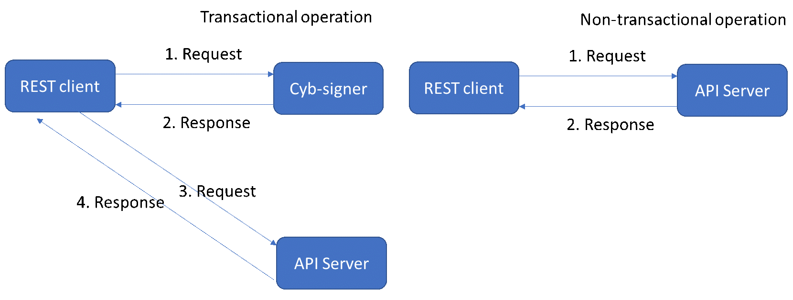

# Introduction

Welcome to the Cybex API! You can use our API to access Cybex exchange. We have language bindings in Shell, Ruby, Python, and JavaScript! You can view code examples in the dark area to the right, and you can switch the programming language of the examples with the tabs in the top right.

Cybex is a decentralized exchange on blockchain, so the usage of API is slightly different compared to traditional ones. There is no convectional authentication, but every transactional operation needs to be signed with your private key. To facilitate the signing process, we developed the tool __cyb-signer__. Once the signer is configured right, you can use the API at ease.



The transactional operation is required to sign with user’s private key before sending to API server. User can use the response message from cyb-signer and send the exact content to API server. However, non-transactional operation can be sent to API server directly.

Inspired by the trending crypto connection library CCXT, CYBEX API adopts similar functional api calls for easier usage. 

public | private 
--------- | ------- 
loadMarkets|fetchBalance      
fetchMarkets| createOrder
fetchOHLCV|cancelOrder
fetchTicker| fetchOrder
fetchOrderBook |fetchOpenOrders 
fetchTrades|fetchMyTrades

# CYBEX API

## Download

## API
### fetchMarkets

Fetches a list of all available markets from an exchange and returns an array of markets (objects with properties such as symbol, base, quote etc.). Some exchanges do not have means for obtaining a list of markets via their online API. For those, the list of markets is hardcoded.

### loadMarkets ([reload]):
Returns the list of markets as an object indexed by symbol and caches it with the exchange instance. Returns cached markets if loaded already, unless the reload = true flag is forced.
    
### fetchOrderBook 
(symbol[, limit = undefined[, params = {}]]): 
Fetch L2/L3 order book for a particular market trading symbol.

### fetchTrades
 (symbol[, since[, [limit, [params]]]]): Fetch recent trades for a particular trading symbol.
### fetchTicker
 (symbol): Fetch latest ticker data by trading symbol.
### fetchBalance
 (): Fetch Balance.
### createOrder
 (symbol, type, side, amount[, price[, params]])
### createLimitBuyOrder
 (symbol, amount, price[, params])
### createLimitSellOrder
 (symbol, amount, price[, params])
### createMarketBuyOrder
 (symbol, amount[, params])
### createMarketSellOrder
 (symbol, amount[, params])
### cancelOrder
 (id[, symbol[, params]])
### fetchOrder
 (id[, symbol[, params]])
### fetchOrders
 ([symbol[, since[, limit[, params]]]])
### fetchOpenOrders
 ([symbol[, since, limit, params]]]])
### fetchClosedOrders
 ([symbol[, since[, limit[, params]]]])
### fetchMyTrades
 ([symbol[, since[, limit[, params]]]])

# cyb-signer installation

## Download

Signer is a open source software, which can be obtained from github. You can use git to clone or download the zip directly.

Type | Link 
--------- | ------- 
signer | https://github.com/CybexDex/cyb-signer.git
release | https://github.com/CybexDex/cyb-signer/releases

`git clone https://github.com/CybexDex/cyb-signer.git`

After cloning, please access release url stated, and put the jar file in “cyb-signer/target” folder.

<aside class="notice">
Cyb-singer is based on Java, in order to make things work, make sure you have <a href="https://adoptopenjdk.net/installation.html" target="_blank">java</a> installed. 
</aside>

<aside class="notice">
If you prefer to build the jar file from source code, you could navigate to cyb-signer/scripts and run build script.<code>./build.sh</code> This requires you have jdk and <a href="https://maven.apache.org/index.html" target="_blank">maven</a> installed.
</aside>

## Config

> Following are example for your reference:

```
SIGNER_SERVER_PORT=8090 (an available port in your local pc)
PRIVATE_KEY=5JicqQ9tcwYoFGXPtFvdM3jAmwEz6Qi1zsuT7muNXCrRND2XXXX (your private key)
ACCOUNT_ID=1.2.xxxxx (your account id in cybex)
API_SERVER_ADDRESS=api.cybex.io
```

All parameters present in the file __env.properties__ under “cyb-signer/scripts” folder.

<aside class="warning">
ACCOUNT ID is not the same as ACCOUNT NAME and its format is 1.2.XXXXX.
</aside>

<aside class="warning"> 
Private key is not your login password in cybex website
</aside>

## Launch
You could use start script to launch/stop cyb-signer. Once cyb-signer starts, you don’t need to restart it unless you want to change parameters.

For Linux users, run

`./start.sh` `./stop.sh` 

For windows users, run

`./start.bat` `./stop.bat` 

For mac users, run

`startMac.sh`

Your signer will be available at http://localhost:8090(your port)
<aside class="warning">
To increase security of signing, cyb-signer and REST-client must be in the same computer, using <b>localhost</b> in the url. (For example, following request will fail: http://192.168.1.10:8090/signer/v1/newOrder)
</aside>

# Signer Endpoints

## Create New Order
```python
import requests

url = "http://127.0.0.1:8090/signer/v1" + "/newOrder"
data = {'assetPair': symbol, 'price': price, 'quantity': quantity, 'side': side}
response = requests.post(url, json=data, headers={'Content-type': 'application/json'})
response.json()
```

```shell
curl "http://127.0.0.1:8090/signer/v1/newOrder"
```

```javascript
var data = {'assetPair': symbol, 'price': price, 'quantity': quantity, 'side': side}
fetch("http://localhost:8090/signer/v1/newOrder", {
    method: "POST", // *GET, POST, PUT, DELETE, etc.
    headers: { "Content-Type": "application/json" },
    body: JSON.stringify(data), // body data type must match "Content-Type" header
})
.then(response => response.json()); // parses response to JSON
```

> The above command returns JSON structured like this:

```json
  {
    "transactionType" : "NewLimitOrder",
    "transactionId" : "40c275d77233c5761472673bd0532150dde723a0",
    "refBlockNum" : 18956,
    "refBlockPrefix" : 507092400,
    "txExpiration" : 1546919505,
    "fee" : {
      "assetId" : "1.3.0",
      "amount" : 55
    },
    "seller" : "1.2.40658",
    "amountToSell" : {
      "assetId" : "1.3.27",
      "amount" : 1466699999
    },
    "minToReceive" : {
      "assetId" : "1.3.2",
      "amount" : 10000000
    },
    "expiration" : 1546991999,
    "signature" : "1c7a00b61039b6bc1ace93916446207a28a69e60a97fbd6b267518754a13e7adca463239452b0e00aa90b71b30a57ea4d65fa4cee44a30ab2c7841fb5cd0145913",
    "fill_or_kill" : 0
  }

```

Create New Order

### HTTP Request

`POST http://localhost:8090/signer/v1/newOrder`

### Query Parameters

Parameter | Example | Description
--------- | ------- | -----------
assetPair | ETH/USDT | 
price | true | 
quantity | 10 | 
side | buy/sell | 

## Create Cancel Order

```python
import requests

url = "http://127.0.0.1:8090/signer/v1" + "/cancelOrder"
data = {'originalTransactionId': trxid}
response = requests.post(url, json=data, headers={'Content-type': 'application/json'})
response.json()
```

```shell
curl --data '{"originalTransactionId": "88cecaa11b8584fb21243cd57ed2227e7c181452"}' http://localhost:8090/signer/v1/cancelOrder
```

```javascript

```

> The above command returns JSON structured like this:

```json
{
  "transactionType" : "Cancel",
  "transactionId" : "e3a8b5c5afd2daa038707aa2e9e2d60701d726c0",
  "originalTransactionId" : "88cecaa11b8584fb21243cd57ed2227e7c181452",
  "refBlockNum" : 18956,
  "refBlockPrefix" : 507092400,
  "txExpiration" : 1546950595,
  "orderId" : "0",
  "fee" : {
    "assetId" : "1.3.0",
    "amount" : 5
  },
  "feePayingAccount" : "1.2.40658",
  "signature" : "1c313f1f34c7975e3999d483ddf1d2d2322751593b82f3f087f987e95a03b1639d696e2348105f2a9070c11c974b2c94ed616d95559108d7714f516fa5ee55d559"
}
```

This endpoint cancel an order with a given id.

### HTTP Request

`GET http://127.0.0.1:8090/signer/v1/cancelOrder`

### URL Parameters

Parameter | Example
--------- | -----------
originalTransactionId | 88cecaa11b8584fb21243cd57ed2227e7c181452

## 	Create CancelAll

```python
import requests

url = "http://127.0.0.1:8090/signer/v1" + "/cancelAll"
data = {'assetPair': symbol}
response = requests.post(url, json=data, headers={'Content-type': 'application/json'})
response.json()
```

```shell
curl --data '{"assetPair": "ETH/USDT"}' http://localhost:8090/signer/v1/cancelAl
```

```javascript
const Cybex = require('Cybex');

let api = Cybex.authorize('meowmeowmeow');
let max = api.kittens.delete(2);
```

> The above command returns JSON structured like this:

```json
{
  "transactionType" : "CancelAll",
  "transactionId" : "9616b03391ccf0107c58326f2674c4b51a7bf284",
  "refBlockNum" : 18956,
  "refBlockPrefix" : 507092400,
  "txExpiration" : 1547007167,
  "fee" : {
    "assetId" : "1.3.0",
    "amount" : 50
  },
  "seller" : "1.2.40658",
  "sellAssetId" : "1.3.2",
  "recvAssetId" : "1.3.27",
  "signature" : "1c3435fd231625f61a516e44bcb193f6344441974cf76def07
1ea01e82a1a2d0043e44ee28993d523fa13bad5445a297cdeef6f0b6a8650
7e8cbba7841ec6a9010"
}

```

This endpoint deletes all orders on a given asset pair.

### HTTP Request

`POST http://localhost:8090/signer/v1/cancelAll`

### URL Parameters

Parameter | Example | Description
--------- | ----------- | -----------
assetPair | ETH/USDT | Use “CYB/CYB” to cancel all your open orders no matter what asset pairs they are in

# API Server Endpoints

## Query reference data

```python
import requests
url = "https://api.cybex.io/v1/refData"
requests.get(url)
```

```shell
curl "https://api.cybex.io/v1/refData"
```

```javascript
const Cybex = require('Cybex');
```

> The above command returns JSON structured like this:

```json
  {
    "chainId" : "90be01e82b981c8f201c9a78a3d31f655743b29ff3274727b1439b093d04aa23",
    "refBlockId" : "008a4a0cb09d391e15712efb101c49a2ed9dfe72",
    "availableAssets" : [{
      "assetName" : "ETH",
      "assetId" : "1.3.2",
      "precision" : 6
    }, {
      "assetName" : "USDT",
      "assetId" : "1.3.27",
      "precision" : 6
    }, {
      "assetName" : "CYB",
      "assetId" : "1.3.0",
      "precision" : 5
    }, {
      "assetName" : "EOS",
      "assetId" : "1.3.4",
      "precision" : 6
    },
     ......
    ],
    "availableAssetPairs" : [{
      "name" : "EOS/USDT",
      "minTickSize" : 0.0001,
      "minQuantity" : 0.1
    }, {
      "name" : "ETH/USDT",
      "minTickSize" : 0.01,
      "minQuantity" : 0.01
    },
    ...... 
    ],
    "fees" : {
      "feeAssetId" : "1.3.0",
      "newFee" : 55,
      "cancelFee" : 5,
      "cancelAllFee" : 50
    }
  }
```

It will return some static data regarding exchange, e.g. chain id, reference block id, available assets, available asset pairs and fee info.

### HTTP Request

`GET  https://api.cybex.io/v1/refData`

## Execute transaction 

```python
import requests
url = "https://api.cybex.io/v1/transaction"
data = {"transactionType": "NewLimitOrder", "transactionId": "040c6466dc0cebb8de40520ebb7346fe0e446b35",  "refBlockNum": 18956,  "refBlockPreix": 507092400,  "txExpiration": 1546926850,  "fee": { "assetId": "1.3.0", "amount": 55  },  "seller": "1.2.40658",  "amountToSell": {"assetId": "1.3.27","amount": 277000},  "minToReceive": {    "assetId": "1.3.4",    "amount": 100000  },  "expiration": 1546991999,  "signature": "1b477931ebb89b39f7e1f1953c9ead66f1c93eee8183f4334729e8f19dceab2a5000af53728952dd73bc3636ab0663cc8f0293714d4c4ed8f3399c5a50b9da2816", "fill_or_kill": 0}
requests.post(url, json=data, headers={'Content-type': 'application/json'})
```

```shell
curl --data '{ "transactionType": "NewLimitOrder",  "transactionId": "040c6466dc0cebb8de40520ebb7346fe0e446b35",  "refBlockNum": 18956,  "refBlockPreix": 507092400,  "txExpiration": 1546926850,  "fee": {    "assetId": "1.3.0",    "amount": 55  },  "seller": "1.2.40658",  "amountToSell": {"assetId": "1.3.27","amount": 277000  },  "minToReceive": {    "assetId": "1.3.4",    "amount": 100000  },  "expiration": 1546991999,  "signature": "1b477931ebb89b39f7e1f1953c9ead66f1c93eee8183f4334729e8f19dceab2a5000af53728952dd73bc3636ab0663cc8f0293714d4c4ed8f3399c5a50b9da2816", "fill_or_kill": 0}' https://api.cybex.io/v1/transaction
```

```javascript
const Cybex = require('Cybex');
```

> The above command returns JSON if success:

```json
  {
    "Status": "Successful",
    "orderSequence": 529016,
    "signature": "1b477931ebb89b39f7e1f1953c9ead66f1c93eee8183f4334729e8f19dceab2a5000af53728952dd73bc3636ab0663cc8f0293714d4c4ed8f3399c5a50b9da2816",
    "time": "2019-01-08T05:53:19.049071Z"
  }
```

> The above command returns JSON if failed:

```json
  {
    "Status" : "Failed",
    "Code" : 1005,
    "Message" : "Duplicated transaction",
    "signature" : "1b477931ebb89b39f7e1f1953c9ead66f1c93eee8183f4334729e8f19dceab2a5000af53728952dd73bc3636ab0663cc8f0293714d4c4ed8f3399c5a50b9da2816"
  }
```

User needs to put the return content from cyb-signer in the content of this post message.

### HTTP Request

`POST https://api.cybex.io/v1/transaction`

### URL Parameters
POST with the json content from cyb-signer in the content of this post message

## Query order status

```python
import requests
url = "https://api.cybex.io/v1/order?accountName=XXXX&reverse=true&orderStatus=FILLED,CANCELED"
requests.get(url)
```

```shell
curl 'https://api.cybex.io/v1/order?accountName=XXXX&reverse=true&orderStatus=FILLED,CANCELED'
```

```javascript
const Cybex = require('Cybex');
```

> The above command returns JSON if success:

```json
  [ 
    {
      "accountName" : "XXXX",
      "orderSequence" : 529016,
      "orderStatus" : "FILLED",
      "assetPair" : "EOS/USDT",
      "side" : "buy",
      "price" : 2.77,
      "quantity" : 0.1,
      "filledQuantity" : 0.102437,
      "averagePrice" : 2.7041010572,
      "transactionId" : "040c6466dc0cebb8de40520ebb7346fe0e446b35",
      "createTime" : "2019-01-08T05:53:19.046342Z",
      "lastUpdateTime" : "2019-01-08T05:53:21.806097Z"
    }, {
      "accountName" : "XXXX",
      "orderSequence" : 169409,
      "orderStatus" : "FILLED",
      "assetPair" : "EOS/USDT",
      "side" : "buy",
      "price" : 2.77,
      "quantity" : 0.1,
      "filledQuantity" : 0.100264,
      "averagePrice" : 2.762706455,
      "transactionId" : "e447bca7d48412d8fc4aecc91224d008a4946145",
      "createTime" : "2019-01-03T01:33:39.501859Z",
      "lastUpdateTime" : "2019-01-03T01:33:42.722457Z"
    }
  ] 

```

This API endpoint is used to query order statuses.

### HTTP Request

`GET https://api.cybex.io/v1/order`

### URL Parameters
    
Parameter | Type | Mandatory | Example | Description
--------- | --------- | ----------- | ----------- |  ----------- 
accountName | STRING |  YES | 1.2.1321  | Your-account-name
reverse | BOOL |  NO |  | If it is true, the most recent record will be shown at the beginning
assetPair | STRING |  NO | ETH/USDT | Asset pair filter
orderStatus | STRING |  NO | FILLED | Use comma as delimiter to include more than one statuses. E.g. FILLED, OPEN
startTime | STRING |  NO | 2018-01-07T01:20:48.647910Z | Beginning time of your query, format must be YYYY-MM-DDTHH:mm:ss.ssssssZ
endTime | STRING |  NO | 2019-01-07T01:20:48.647910Z | End time of your query, format must be YYYY-MM-DDTHH:mm:ss.ssssssZ.
start | INT |  NO | 0 | Number where result will be shown from
limit | INT |  NO | 100 | Max number of results returned
transactionId | STRING | NO | 410sdl8ila | Query by transaction id
    
## Query trade

```python
import requests
url = "https://api.cybex.io/v1/trade?accountName=XXXXXX&reverse=true"
requests.get(url)
```

```shell
curl 'https://api.cybex.io/v1/trade?accountName=XXXXXX&reverse=true'
```

```javascript
const Cybex = require('Cybex');
```

> The above command returns JSON if success:

```json
  [ {
    "accountName" : "XXXX",
    "orderSequence" : 529016,
    "chainOrderId" : 395937330,
    "assetPair" : "EOS/USDT",
    "side" : "buy",
    "orderPrice" : 2.77,
    "orderQuantity" : 0.1,
    "tradePrice" : 2.7041010572,
    "tradeQuantity" : 0.102437,
    "blockTime" : "2019-01-08T05:53:21.000000Z"
  }, {
    "accountName" : "XXXX",
    "orderSequence" : 169409,
    "chainOrderId" : 384202079,
    "assetPair" : "EOS/USDT",
    "side" : "buy",
    "orderPrice" : 2.77,
    "orderQuantity" : 0.1,
    "tradePrice" : 2.762706455,
    "tradeQuantity" : 0.100264,
    "blockTime" : "2019-01-03T01:33:42.000000Z"
  }, {
    "accountName" : "XXXX",
    "orderSequence" : 792863,
    "chainOrderId" : 382273197,
    "assetPair" : "ETH/USDT",
    "side" : "sell",
    "orderPrice" : 143.1,
    "orderQuantity" : 0.01,
    "tradePrice" : 143.1799,
    "tradeQuantity" : 0.01,
    "blockTime" : "2019-01-02T07:52:54.000000Z"
  } ]

```

This API endpoint is used to query order statuses.

### HTTP Request

`GET https://api.cybex.io/v1/trade`

### URL Parameters
    
    Parameter | Type | Mandatory | Example | Description
    --------- | --------- | ----------- | ----------- |  ----------- 
    accountName | STRING |  YES | 1.2.1321  | Your-account-name
    reverse | BOOL |  NO |  | If it is true, the most recent record will be shown at the beginning
    assetPair | STRING |  NO | ETH/USDT | Asset pair filter
    startTime | STRING |  NO | 2018-01-07T01:20:48.647910Z | Beginning time of your query, format must be YYYY-MM-DDTHH:mm:ss.ssssssZ
    endTime | STRING |  NO | 2019-01-07T01:20:48.647910Z | End time of your query, format must be YYYY-MM-DDTHH:mm:ss.ssssssZ.
    start | INT |  NO | 0 | Number where result will be shown from
    limit | INT |  NO | 100 | Max number of results returned

## Query account position

```python
import requests
url = "https://api.cybex.io/v1/position?accountName=XXXX"
requests.get(url)
```

```shell
curl 'https://api.cybex.io/v1/position?accountName=XXXX'
```

```javascript
const Cybex = require('Cybex');
```

> The above command returns JSON if success:

```json
  {
    "accountName" : "XXXX",
    "positions" : [ {
      "assetName" : "CYB",
      "quantity" : 3290.30569
    }, {
      "assetName" : "ETH",
      "quantity" : 0.377978
    }, {
      "assetName" : "USDT",
      "quantity" : 4.376498
    }, {
      "assetName" : "EOS",
      "quantity" : 0.202701
    } ],
    "time" : "2019-01-08T06:19:42.025291Z"
  }
```

This API endpoint is used to query account current position.

### HTTP Request

`GET https://api.cybex.io/v1/position`

### URL Parameters
    
Parameter | Type | Mandatory | Example | Description
--------- | --------- | ----------- | ----------- |  ----------- 
accountName | STRING |  YES | 1.2.1321  | Your-account-name

## Query order book

```python
url = "https://api.cybex.io/v1/orderBook?assetPair=ETH/USDT&limit=3"
requests.get(url)
```

```shell
curl 'https://api.cybex.io/v1/orderBook?assetPair=ETH/USDT&limit=3'
```

```javascript
const Cybex = require('Cybex');
```

> The above command returns JSON if success:

```json
  {
  	"assetPair": "ETH/USDT",
  	"bids": [
  		[
  			"146.31",
  			"5.0",
  			"731.55"
  		],
  		[
  			"146.3",
  			"3.192823",
  			"467.110114"
  		],
  		[
  			"146.28",
  			"3.0",
  			"438.84"
  		]
  	],
  	"asks": [
  		[
  			"146.36",
  			"3.902031",
  			"571.062364"
  		],
  		[
  			"146.39",
  			"3.19903",
  			"468.306001"
  		],
  		[
  			"146.41",
  			"3.742901",
  			"547.960743"
  		]
  	],
  	"time": "2019-01-08T06:22:37.47311Z"
  }

```

This API endpoint is used to query order book of given asset pair.

### HTTP Request

`GET https://api.cybex.io/v1/orderBook`

### URL Parameters
    
Parameter | Type | Mandatory | Example | Description |
--------- | --------- | ----------- | ----------- |  ------ 
assetPair | STRING |  YES | ETH/USDT  | target asset pair
limit | INT | YES | 10 | Number of levels
    

## Query candle stick

```python
url = "https://api.cybex.io/v1/klines?assetPair=EOS/USDT&interval=1m&limit=2"
requests.get(url)
```

```shell
curl 'https://api.cybex.io/v1/klines?assetPair=EOS/USDT&interval=1m&limit=2'
```

> The above command returns JSON if success:

```
[
  [
    1546928820000,   // Open time
    "2.70150000",     // Open price
    "2.70240000",     // High
    "2.70150000",     // Low
    "2.70200000",    // Close
    "282.91000000",  //Volume
    1546928879999,  // Close time
    "764.40811500",  // Quote asset volume
    3,                             // Number of trades
    "64.45000000",   // Taker buy base asset volume
    "174.16968000",  // Taker buy quote asset volume
    "0"   // Reserved
  ],
  [
    1546928880000,
    "2.70200000",
    "2.70200000",
    "2.70160000",
    "2.70160000",
    "163.48000000",
    1546928939999,
    "441.70876800",
    2,
    "163.48000000",
    "441.70876800",
    "0"
  ]
]
```

### HTTP Request

`GET https://api.cybex.io/v1/klines`

### URL Parameters


|Parameter|Type|Mandatory|Example value|
| --- | --- | --- | --- |
| assetPair | STRING | YES | E.g. ETH/USDT, EOS/USDT |
interval | ENUM | YES | 1m, 3m, , 5m, 15m, 30m, 1h, 2h, 4h, 6h, 8h, 12h, 1d, 3d, 1w, 1M
startTime | LONG | NO | Beginning time of the query, the format must be YYYY-MM-DDTHH:mm:ss.ssssssZ. E.g. 2018-01-07T01:20:48.647910Z
endTime | LONG | NO | End time of the query, the format must be YYYY-MM-DDTHH:mm:ss.ssssssZ. E.g. 2019-01-07T01:20:48.647910Z
limit | INT | NO | Level to be shown
useTradePrice | BOOL | NO | Default is "false", and this api returns market prices. If it is specified as "true" then this api returns our exchange's prices.  

   
# Wrap it up

## Simple start

```python
from cybexapi import SignerConnector, CybexRestful

# init the signer object and api rest object
signer = SignerConnector(api_root="http://127.0.0.1:8090/signer/v1")
api_server = CybexRestful(api_root="https://api.cybex.io/v1")

# prepar the order data you want to place
# then sign the new limit order
order_msg = signer.prepare_order_message(asset_pair='ETH/USDT', price=80, quantity=0.1, side='buy')
# extract the trx id for later use
trx_id = order_msg['transactionId']

# then exexcute
order_result = api_server.send_transaction(order_msg)

# Now we do the cancel operation 
# prepare the trx id
# then sign the cancel order
cancel_msg = signer.prepare_cancel_message(trx_id)
# then exexcute
cancel_result = api_server.send_transaction(cancel_msg)
```

Hooray, now you know everything about Cybex API. We wrap all endpoints together, and come up with a [api connecter](https://github.com/CybexDex/cybex-python/blob/master/cybexapi.py).

Here is an demo of usage of the API connector. Make sure you have the signer running beforehand.

The demo shows the process of create a new buy order and then cancel it. You may also find the complete script [here](https://github.com/CybexDex/cybex-python/blob/master/cybex-demo.py)


## Getting to pro
Once you get create and cancel orders working, you might start to do something more exciting, 
like analyzing signals, implementing a quantitative trading model of your own, and start to make money, hopefully.

We wrote a sample strategy for that purpose, too. You can find it [here](https://github.com/CybexDex/cybex-python).
